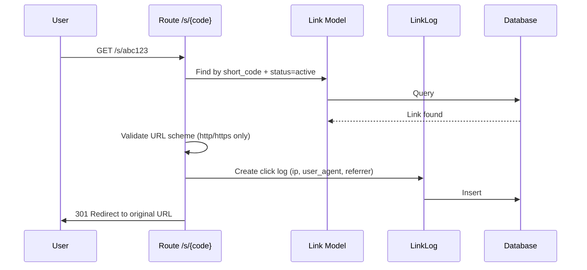

# 🔗 shrt.dev — Laravel URL Shortener


A **developer-first URL shortener** built with **Laravel 13 + Livewire/Volt + Tailwind CSS**. Create short links, track every click with real-time analytics, and manage everything from a clean dashboard.

Inspired by Supabase's dark-mode-native design system with emerald green accents.

> 🎓 **Learning Project**: This is an experimental project built while learning fullstack Laravel development. The codebase follows Laravel best practices and is a work in progress as I continue learning PHP and Laravel!

---

## 📸 Overview

> Screenshots will be added after more sample data is available.

---

## 📚 Table of Contents

- [Features](#-features)
- [System Architecture](#-system-architecture)
- [Project Structure](#-project-structure)
- [Prerequisites](#-prerequisites)
- [Getting Started](#-getting-started)
    - [1. Clone & Install](#1-clone--install)
    - [2. Environment Configuration](#2-environment-configuration)
    - [3. Database Setup](#3-database-setup)
    - [4. Run Application](#4-run-application)
- [Available Scripts](#-available-scripts)
- [Application Flow](#-application-flow)
- [Architecture Patterns](#-architecture-patterns)
- [Testing](#-testing)
- [Troubleshooting](#-troubleshooting)

---

## ✨ Features

- **URL Shortening** — Transform long URLs into clean, memorable short links
- **Click Tracking** — Log every click with IP, user agent, and referrer
- **Real-time Analytics** — Dashboard with total links, clicks, and unique visitors
- **Click Trend Charts** — 7-day and 30-day trend visualization
- **Top Referrers** — Track where your traffic comes from
- **Search & Filter** — Find links quickly with search functionality
- **Responsive Design** — Mobile-first with Tailwind CSS
- **Rate Limiting** — Custom SmartThrottle middleware for API protection
- **Open Redirect Protection** — URL scheme validation to prevent attacks
- **Authentication** — Built-in auth via Livewire starter stack (Volt + session auth)
- **Password Reset with OTP** — Secure password reset flow with email OTP
- **Soft Deletes** — Data safety with soft delete on links
- **Accessibility** — Skip-to-content links, screen reader support, ARIA labels

---

## 🏗 System Architecture

### High-Level Application Flow

```mermaid
graph TD
    subgraph Public
        U[User] -->|Short URL| R[Redirect /s/{code}]
        R -->|Log Click| LL[LinkLog]
        R -->|301 Redirect| EXT[Original URL]
    end

    subgraph Authenticated
        U -->|Manage| D[Dashboard]
        U -->|Create| CL[Create Link]
        U -->|View| LD[Link Detail]
    end

    subgraph Data
        L[Link Model] -->|has many| LL
        U[User] -->|has many| L
    end

    CL -->|Generate| SC[ShortCodeService]
    SC -->|Unique Code| L
```

### Short URL Redirect Flow



---

## 📁 Project Structure

```
shrt.dev/
├── app/
│   ├── Http/
│   │   ├── Controllers/
│   │   │   └── Controller.php              # Base controller
│   │   ├── Middleware/
│   │   │   └── SmartThrottle.php           # Custom rate limiting
│   │   └── Requests/
│   │       └── StoreLinkRequest.php        # Link creation validation
│   ├── Livewire/
│   │   ├── Actions/
│   │   │   └── Logout.php                  # Logout action
│   │   └── Forms/
│   │       └── LoginForm.php               # Login form with rate limiting
│   ├── Models/
│   │   ├── User.php                        # User model
│   │   ├── Link.php                        # Link model with status constants
│   │   ├── LinkLog.php                     # Click tracking model
│   │   └── PasswordResetOtp.php            # OTP for password reset
│   ├── Notifications/
│   │   └── SendOtpNotification.php         # OTP email notification
│   ├── Policies/
│   │   └── LinkPolicy.php                  # Link authorization
│   ├── Services/
│   │   ├── ShortCodeService.php            # Short code generation
│   │   └── Auth/
│   │       └── PasswordResetOtpService.php # OTP-based password reset
│   └── Support/
│       └── Security/
│           ├── RateLimitBucket.php         # Rate limit bucket config
│           ├── RateLimitGuard.php          # Rate limit enforcement
│           ├── RateLimitKey.php            # Rate limit key generation
│           ├── RateLimitPolicy.php         # Rate limit policies
│           └── RateLimitResult.php         # Rate limit result DTO
├── database/
│   ├── factories/
│   │   ├── UserFactory.php
│   │   ├── LinkFactory.php                 # With archived state
│   │   └── LinkLogFactory.php
│   ├── migrations/                         # 10 migration files
│   └── seeders/
│       └── DatabaseSeeder.php
├── resources/
│   ├── views/
│   │   ├── livewire/
│   │   │   ├── dashboard.blade.php         # Stats + popular links
│   │   │   ├── links/
│   │   │   │   ├── index.blade.php         # Link list + create/delete modals
│   │   │   │   └── show.blade.php          # Link detail + analytics
│   │   │   └── pages/auth/                 # Auth pages (login, register, etc.)
│   │   ├── components/                     # Blade components (modal, nav)
│   │   ├── layouts/                        # App + Guest layouts
│   │   ├── profile.blade.php               # User profile
│   │   └── welcome.blade.php               # Landing page
│   └── css/
│       └── app.css                         # Tailwind entry
├── routes/
│   ├── web.php                             # Web routes
│   └── auth.php                            # Auth routes
├── tests/
│   └── Feature/                            # 92 feature tests
├── DESIGN.md                               # Design system documentation
├── tailwind.config.js                      # Tailwind with custom colors
├── composer.json
├── package.json
└── phpunit.xml
```

---

## ✅ Prerequisites

Before you begin, ensure you have the following installed:

1. **PHP** (8.4 or later) with extensions:
    - `pdo_sqlite`, `mbstring`, `openssl`, `json`, `fileinfo`

2. **Composer** (PHP package manager)

    ```bash
    curl -sS https://getcomposer.org/installer | php
    mv composer.phar /usr/local/bin/composer
    ```

3. **Node.js** (18+ or 20+) and **NPM**

4. **Git**

---

## 🚀 Getting Started

Follow these steps to get the application running locally.

### 1. Clone & Install

```bash
git clone https://github.com/aldoignatachandra/url-shortener-project.git
cd url-shortener-project

# Install PHP dependencies
composer install

# Install Node.js dependencies
npm install
```

### 2. Environment Configuration

Copy the example environment file and configure it:

```bash
cp .env.example .env

# Generate application key
php artisan key:generate
```

**Critical Variables:**

| Variable        | Description      | Default (Local)         |
| --------------- | ---------------- | ----------------------- |
| `APP_NAME`      | Application name | `Laravel`               |
| `APP_URL`       | Base URL         | `http://localhost:8000` |
| `DB_CONNECTION` | Database driver  | `sqlite`                |

### 3. Database Setup

**Run migrations:**

```bash
php artisan migrate
```

**Seed the database (optional):**

```bash
php artisan db:seed
```

### 4. Run Application

**Start the development server:**

```bash
# Option 1: Simple
php artisan serve

# Option 2: With queue, logs (no Vite)
composer run dev:api

# Option 3: Full stack (with Vite)
composer run dev
```

The application will be available at:

- **Frontend**: `http://localhost:8000`
- **Dashboard**: `http://localhost:8000/dashboard`

**Build for production:**

```bash
npm run build
```

---

## 🧰 Available Scripts

| Script                    | Description                                              |
| ------------------------- | -------------------------------------------------------- |
| `composer install`        | Install PHP dependencies                                 |
| `composer dev`            | Run full dev environment (Laravel + Queue + Logs + Vite) |
| `composer dev:api`        | Run API-only dev (no Vite)                               |
| `composer test`           | Run PHPUnit tests                                        |
| `npm install`             | Install Node.js dependencies                             |
| `npm run dev`             | Start Vite development server                            |
| `npm run build`           | Build assets for production                              |
| `php artisan serve`       | Start Laravel development server                         |
| `php artisan migrate`     | Run database migrations                                  |
| `php artisan db:seed`     | Seed database with sample data                           |
| `php artisan route:list`  | List all routes                                          |
| `vendor/bin/pint --dirty` | Format changed PHP files                                 |

---

## 🔄 Application Flow

### Public Routes

| Route           | Description                    |
| --------------- | ------------------------------ |
| `GET /`         | Landing page                   |
| `GET /s/{code}` | Redirect to original URL (301) |

### Authenticated Routes

| Route                  | Description               |
| ---------------------- | ------------------------- |
| `GET /dashboard`       | Dashboard with stats      |
| `GET /links`           | Link list with CRUD       |
| `POST /links`          | Create new short link     |
| `GET /links/{link}`    | Link detail + analytics   |
| `DELETE /links/{link}` | Delete link (soft delete) |
| `GET /profile`         | User profile              |

### Auth Routes

| Route                  | Description        |
| ---------------------- | ------------------ |
| `GET /login`           | Login page         |
| `GET /register`        | Registration page  |
| `GET /forgot-password` | Password reset     |
| `GET /verify-email`    | Email verification |

---

## 🏗️ Architecture Patterns

### Service Layer Pattern

Business logic lives in Services, not Controllers:

```php
class ShortCodeService
{
    public const MAX_GENERATION_ATTEMPTS = 10;

    public static function generateUnique(int $maxAttempts = null): string
    {
        $maxAttempts ??= self::MAX_GENERATION_ATTEMPTS;

        for ($i = 0; $i < $maxAttempts; $i++) {
            $code = static::generate();

            if (! Link::where('short_code', $code)->exists()) {
                return $code;
            }
        }

        throw new \RuntimeException('Unable to generate unique short code.');
    }
}
```

### Model Constants

Magic numbers replaced with named constants:

```php
class Link extends Model
{
    public const STATUS_ACTIVE = 1;
    public const STATUS_ARCHIVED = 2;

    public function isActive(): bool
    {
        return $this->status === self::STATUS_ACTIVE;
    }
}
```

### Eager Loading (N+1 Prevention)

```php
// ✅ Good: Check for eager-loaded data first
public function clickCount(): int
{
    if ($this->relationLoaded('logs')) {
        return $this->logs->count();
    }

    if (isset($this->attributes['logs_count'])) {
        return (int) $this->attributes['logs_count'];
    }

    return $this->logs()->count();
}
```

### Custom Rate Limiting

```php
class RateLimitPolicy
{
    public static function api(Request $request): array
    {
        return [
            new RateLimitBucket(
                key: RateLimitKey::actor($request, 'api:minute'),
                maxAttempts: 60,
                decaySeconds: 60,
            ),
        ];
    }
}
```

---

## 🧪 Testing

Run the test suite:

```bash
# Run all tests
php artisan test

# Run with compact output
php artisan test --compact

# Run specific test file
php artisan test --compact tests/Feature/LinkRedirectTest.php

# Run specific test
php artisan test --compact --filter=test_can_create_courier
```

### Test Organization

```
tests/
├── Feature/
│   ├── Auth/                    # Authentication tests (7 files)
│   ├── DashboardTest.php        # Dashboard stats tests
│   ├── LinkDetailTest.php       # Link analytics tests
│   ├── LinkRedirectTest.php     # Short URL redirect tests
│   ├── LinksListTest.php        # Link CRUD tests
│   ├── LandingPageTest.php      # Landing page tests
│   └── ProfileTest.php          # Profile tests
└── TestCase.php                 # Base test class
```

### Test Coverage

| Category       | Tests    | Status           |
| -------------- | -------- | ---------------- |
| Authentication | 7 files  | ✅ Comprehensive |
| Link Redirect  | 6 tests  | ✅ Good          |
| Link CRUD      | 12 tests | ✅ Good          |
| Link Detail    | 7 tests  | ✅ Good          |
| Dashboard      | 4 tests  | ✅ Good          |

---

## 🔧 Troubleshooting

| Issue                          | Possible Cause          | Solution                               |
| ------------------------------ | ----------------------- | -------------------------------------- |
| **Database connection failed** | SQLite file not created | Run `touch database/database.sqlite`   |
| **Class not found**            | Autoload not updated    | Run `composer dump-autoload`           |
| **419 Page Expired**           | CSRF token missing      | Add `@csrf` to forms                   |
| **Vite manifest error**        | Assets not built        | Run `npm run build` or `npm run dev`   |
| **Migration error**            | Schema mismatch         | Run `php artisan migrate:fresh`        |
| **Permission denied**          | File permissions        | Run `chmod -R 775 storage/`            |
| **CSS not loading**            | Vite not running        | Run `npm run dev` in separate terminal |
| **Blank page / 500 error**     | Check logs              | Read `storage/logs/laravel.log`        |

### Debug Commands

```bash
# Check Laravel version
php artisan --version

# List all routes
php artisan route:list

# Clear all caches
php artisan optimize:clear

# Check migration status
php artisan migrate:status

# Monitor logs in real-time
php artisan pail
```

---

## 📝 Notes

This is a learning project — features and implementation may evolve as I continue exploring Laravel and PHP best practices. The codebase follows:

- **Laravel Boost** guidelines for best practices
- **Supabase-inspired** dark-mode design system
- **Livewire/Volt** for reactive components
- **Custom rate limiting** with SmartThrottle middleware
- **Feature tests** with 92 passing tests

---

## 📄 License

This project is licensed under the MIT License.

---

Built for learning Laravel through practical URL shortener development with **Laravel 13 + Livewire 3 + Tailwind CSS 3**.
